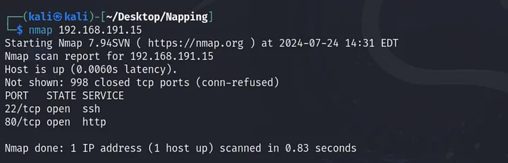
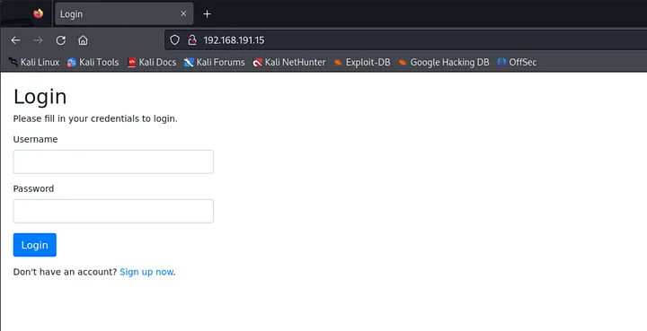
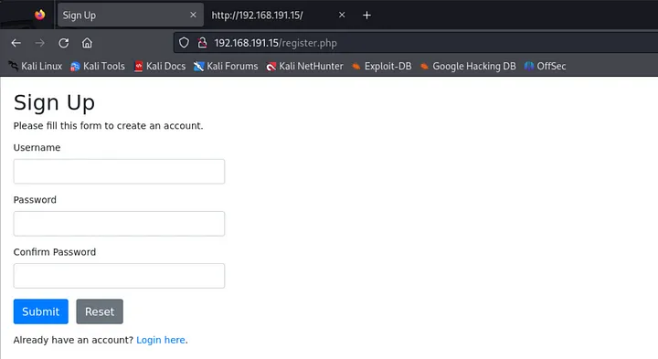
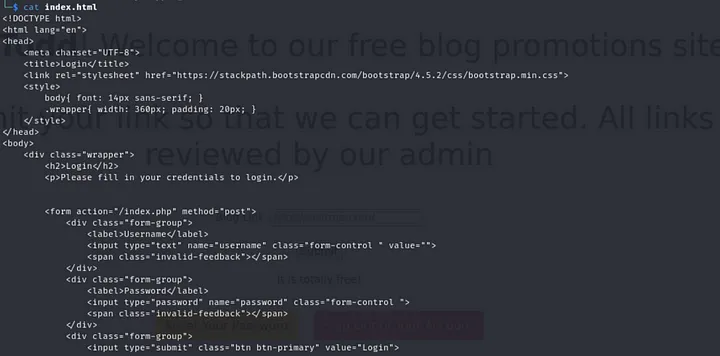
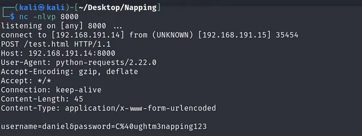
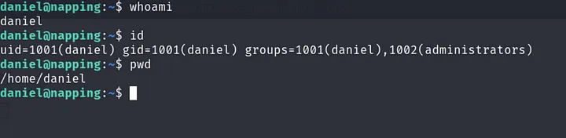
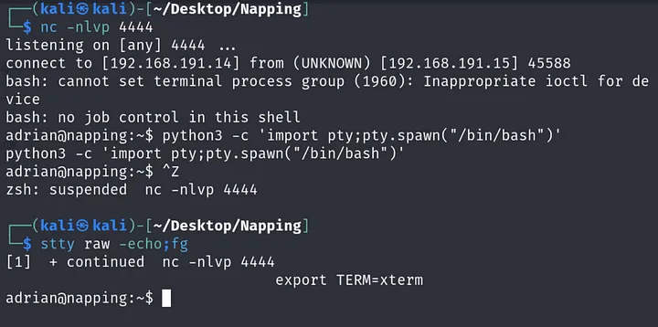

# Vulnhub Napping Walkthrough

## Introduction

Napping is a vulnerable machine found on Vulnhub. This walkthrough details the process of exploiting the machine to gain root access.

## Reconnaissance

The first step was to identify the IP address of the vulnerable machine. An initial nmap scan of the network revealed the target IP as 192.168.191.15.

A more detailed nmap scan showed two open ports:
- Port 22 (SSH)
- Port 80 (HTTP)



Given these results, the web server seemed the most likely vector for initial access.

## Initial Access

### Exploring the Web Server

The web server presented a login page.



Clicking on the "sign up now" button revealed a registration process.



After creating an account and logging in, I was presented with a dashboard.


While exploring the web application, I ran some scans to look for interesting directories, but this didn't yield any useful results.

### Exploiting the Blog Link Submit Form

The dashboard contained a Blog Link submit form, which caught my attention.



Examining the page source revealed that submitted links would open in a new tab using `target="_blank"`. This hinted at a potential vulnerability related to the `window.opener` object.

To exploit this:

1. I created a fake login page mimicking the target's login page.
2. I created an HTML page with the `window.opener` object to capture credentials.
3. Set up a netcat listener:
   ```
   nc -nvlp 4444
   ```
4. Set up a web server and submitted a link to the malicious HTML page on the target site.
5. Clicked the link, returned to the original page, and captured the credentials on the listener.



## Privilege Escalation

With the captured credentials, I used SSH to log into the target machine as the user 'daniel'.



### Escalating to 'adrian'

I discovered that Daniel was part of the 'administrators' group. Further investigation revealed another user, 'adrian', with a file called 'query.py' in his directory.

The 'query.py' file had write permissions for the 'administrators' group. I added code to create another netcat listener for the 'adrian' user.

### Reaching Root

Running `sudo -l` as adrian revealed that this user could run vim as sudo. Consulting GTFOBins for vim provided the necessary steps to reach root access.



## Conclusion

The Napping box demonstrated vulnerabilities in web application security, particularly around the use of `target="_blank"` without proper safeguards. It also highlighted the importance of carefully managing sudo privileges and group permissions.
